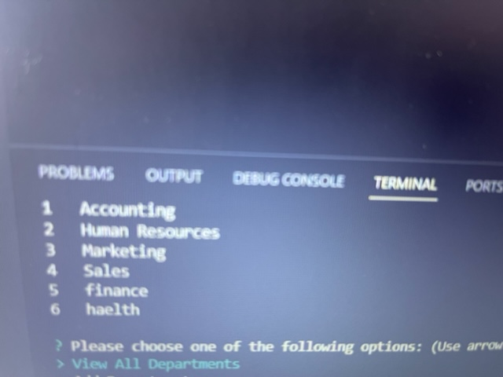
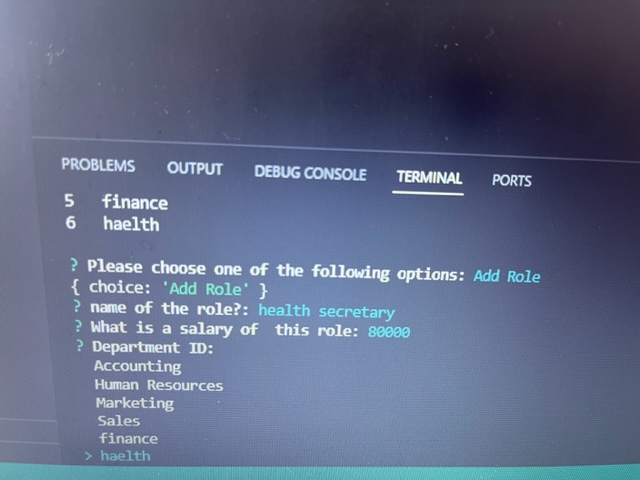
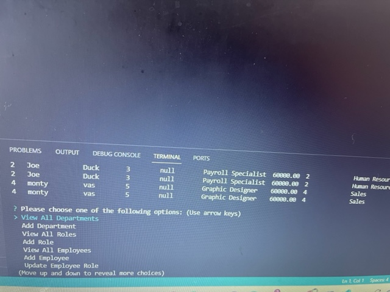
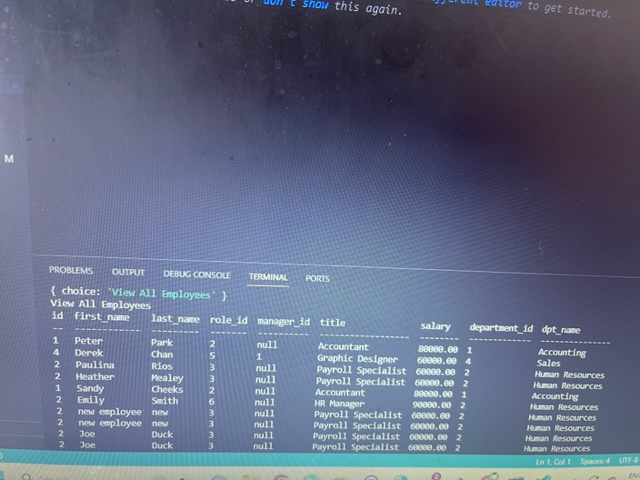
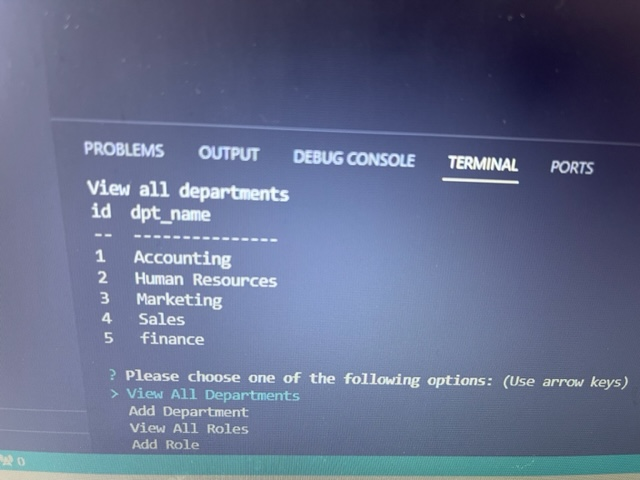
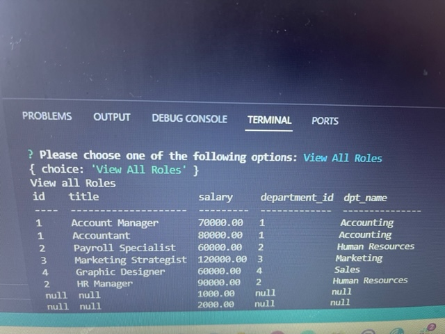

##   TITLE - Employee-Tracker

  ## Table of contents:
  - [Description](#description)
  - [Installation](##installation)
  - [Technologies/Libraries](## Technologies/library)
  - [Usage](#usage)
  - [Contribution](#Contribution)
  - [Testing](#Testing)

  ## Demo:

https://drive.google.com/file/d/1CIP0VZoAy9ka5ZNfjpKXsCudWwRXEIxe/view

  https://github.com/phvania/Employee-Tracker
  

  ##screenshot:
  
  
   
   
   
   
  
   
  
  
  

## Description:
An Commond line Application for managing a company's employees using node,inquirer and MySQL.

your schema should contain the following three tables:

* `department`

    * `id`: `INT PRIMARY KEY`

    * `name`: `VARCHAR(30)` to hold department name

* `role`

    * `id`: `INT PRIMARY KEY`

    * `title`: `VARCHAR(30)` to hold role title

    * `salary`: `DECIMAL` to hold role salary

    * `department_id`: `VARCHAR(30)` to hold reference to department role belongs to

* `employee`

    * `id`: `INT PRIMARY KEY`

    * `first_name`: `VARCHAR(30)` to hold employee first name

    * `last_name`: `VARCHAR(30)` to hold employee last name

    * `role_id`: `INT` to hold reference to employee role

    * `manager_id`: `INT` to hold reference to another employee that is the manager of the current employee (`null` if the employee has no manager)

## Installation:
In your terminal type:git clone to your github repository.
open in VS  to build and run
for more information, visit github help page.

## Technologies-Libraries:
Inquirer, MySQL, Node, JavaScript

## Demo:

## screenshot:
